# 🔗 Blockchain Process Flow Diagrams

## 📊 Mermaid Diagram (Recommended)

```mermaid
graph LR
    %% Styling
    classDef issuer fill:#007bff,stroke:#0056b3,stroke-width:2px,color:#fff
    classDef participant fill:#28a745,stroke:#1e7e34,stroke-width:2px,color:#fff
    classDef miner fill:#6f42c1,stroke:#5a32a3,stroke-width:2px,color:#fff
    classDef process fill:#ffc107,stroke:#e0a800,stroke-width:2px,color:#000
    classDef pending fill:#fd7e14,stroke:#e8590c,stroke-width:2px,color:#fff

    %% Asset Issuance Flow
    I[🏦 Token Issuer<br/>Initiates Token Creation]:::issuer
    I --> II[📝 Issue Tokens<br/>Amount: 1000<br/>Asset: Gold Coins<br/>To: Participant A]:::process
    II --> P1[⏳ Pending Pool<br/>Awaiting Validation]:::pending
    
    %% Mining Validation for Issuance
    M1[⚡ Payment Provider<br/>Initiates Mining]:::miner
    M1 --> MV1[⛏️ Mine Block<br/>Validate Issuance<br/>Create Block #1]:::process
    P1 --> MV1
    MV1 --> B1[📦 Block Created<br/>Tokens Distributed<br/>Balance Updated]:::process

    %% Token Transfer Flow
    PA[👤 Participant A<br/>Initiates Transfer]:::participant
    PA --> T1[💸 Transfer Tokens<br/>Amount: 250<br/>To: Participant B]:::process
    T1 --> P2[⏳ Pending Pool<br/>Awaiting Validation]:::pending
    
    %% Mining Validation for Transfer
    M2[⚡ Payment Provider<br/>Initiates Mining]:::miner
    M2 --> MV2[⛏️ Mine Block<br/>Validate Transfer<br/>Create Block #2]:::process
    P2 --> MV2
    MV2 --> B2[📦 Block Created<br/>Transfer Confirmed<br/>Balances Updated]:::process

    %% Additional Transfer Flow
    PB[👤 Participant B<br/>Initiates Transfer]:::participant
    PB --> T2[💸 Transfer Tokens<br/>Amount: 100<br/>To: Participant C]:::process
    T2 --> P3[⏳ Pending Pool<br/>Awaiting Validation]:::pending
    
    %% Final Mining
    M3[⚡ Payment Provider<br/>Initiates Mining]:::miner
    M3 --> MV3[⛏️ Mine Block<br/>Validate Transfer<br/>Create Block #3]:::process
    P3 --> MV3
    MV3 --> B3[📦 Block Created<br/>Final Balances<br/>A: 750, B: 150, C: 100]:::process

    %% Flow connections
    B1 --> PA
    B2 --> PB
```

## 🎯 Process Flow Explanation

### **Phase 1: Asset Issuance & Distribution**
1. **🏦 Token Issuer** initiates token creation
2. **📝 Issue Transaction** created (1000 Gold Coins → Participant A)
3. **⏳ Transaction** enters pending pool
4. **⚡ Payment Provider** initiates mining process
5. **⛏️ Mining** validates and creates Block #1
6. **📦 Block Created** - tokens distributed, balances updated

### **Phase 2: Token Transfer (A → B)**
1. **👤 Participant A** initiates transfer
2. **💸 Transfer Transaction** created (250 tokens → Participant B)
3. **⏳ Transaction** enters pending pool
4. **⚡ Payment Provider** initiates mining process
5. **⛏️ Mining** validates and creates Block #2
6. **📦 Block Created** - transfer confirmed, balances updated

### **Phase 3: Token Transfer (B → C)**
1. **👤 Participant B** initiates transfer
2. **💸 Transfer Transaction** created (100 tokens → Participant C)
3. **⏳ Transaction** enters pending pool
4. **⚡ Payment Provider** initiates mining process
5. **⛏️ Mining** validates and creates Block #3
6. **📦 Block Created** - final balances: A: 750, B: 150, C: 100

---

## 📈 Graphviz Diagram (Alternative)

```dot
digraph BlockchainProcess {
    rankdir=LR;
    node [shape=box, style=filled];
    
    // Styling
    subgraph cluster_legend {
        label="Role Legend";
        style=filled;
        color=lightgrey;
        
        issuer [label="🏦 Token Issuer", fillcolor="#007bff", fontcolor="white"];
        participant [label="👤 Participant", fillcolor="#28a745", fontcolor="white"];
        miner [label="⚡ Payment Provider", fillcolor="#6f42c1", fontcolor="white"];
        process [label="📝 Process", fillcolor="#ffc107"];
        pending [label="⏳ Pending", fillcolor="#fd7e14", fontcolor="white"];
    }
    
    // Asset Issuance Flow
    I1 [label="🏦 Token Issuer\nInitiates Token Creation", fillcolor="#007bff", fontcolor="white"];
    II1 [label="📝 Issue Tokens\nAmount: 1000\nAsset: Gold Coins\nTo: Participant A", fillcolor="#ffc107"];
    P1 [label="⏳ Pending Pool\nAwaiting Validation", fillcolor="#fd7e14", fontcolor="white"];
    M1 [label="⚡ Payment Provider\nInitiates Mining", fillcolor="#6f42c1", fontcolor="white"];
    MV1 [label="⛏️ Mine Block\nValidate Issuance\nCreate Block #1", fillcolor="#ffc107"];
    B1 [label="📦 Block Created\nTokens Distributed\nBalance Updated", fillcolor="#ffc107"];
    
    // Transfer Flow 1
    PA [label="👤 Participant A\nInitiates Transfer", fillcolor="#28a745", fontcolor="white"];
    T1 [label="💸 Transfer Tokens\nAmount: 250\nTo: Participant B", fillcolor="#ffc107"];
    P2 [label="⏳ Pending Pool\nAwaiting Validation", fillcolor="#fd7e14", fontcolor="white"];
    M2 [label="⚡ Payment Provider\nInitiates Mining", fillcolor="#6f42c1", fontcolor="white"];
    MV2 [label="⛏️ Mine Block\nValidate Transfer\nCreate Block #2", fillcolor="#ffc107"];
    B2 [label="📦 Block Created\nTransfer Confirmed\nBalances Updated", fillcolor="#ffc107"];
    
    // Transfer Flow 2
    PB [label="👤 Participant B\nInitiates Transfer", fillcolor="#28a745", fontcolor="white"];
    T2 [label="💸 Transfer Tokens\nAmount: 100\nTo: Participant C", fillcolor="#ffc107"];
    P3 [label="⏳ Pending Pool\nAwaiting Validation", fillcolor="#fd7e14", fontcolor="white"];
    M3 [label="⚡ Payment Provider\nInitiates Mining", fillcolor="#6f42c1", fontcolor="white"];
    MV3 [label="⛏️ Mine Block\nValidate Transfer\nCreate Block #3", fillcolor="#ffc107"];
    B3 [label="📦 Block Created\nFinal Balances\nA: 750, B: 150, C: 100", fillcolor="#ffc107"];
    
    // Connections
    I1 -> II1 -> P1;
    M1 -> MV1;
    P1 -> MV1 -> B1;
    
    B1 -> PA -> T1 -> P2;
    M2 -> MV2;
    P2 -> MV2 -> B2;
    
    B2 -> PB -> T2 -> P3;
    M3 -> MV3;
    P3 -> MV3 -> B3;
}
```

---

## 🔑 Key Insights from the Diagram

### **Role Responsibilities:**

#### **🏦 Token Issuers:**
- **Initiate**: Asset creation and distribution
- **Cannot**: Complete transactions without mining validation
- **Dependency**: Requires payment providers for confirmation

#### **👤 Participants:**
- **Initiate**: Token transfers between accounts
- **Cannot**: Transfer without sufficient balance or mining validation
- **Dependency**: Requires payment providers for transaction confirmation

#### **⚡ Payment Providers:**
- **Initiate**: Mining and block creation processes
- **Validate**: All transactions (issuance and transfers)
- **Create**: New blocks containing validated transactions
- **Enable**: All other operations through validation

### **Critical Dependencies:**
1. **No Direct Completion**: Neither issuers nor participants can complete transactions alone
2. **Mining Required**: All operations require payment provider validation
3. **Sequential Process**: Each step depends on the previous step's completion
4. **Pending State**: All transactions wait in pending pool until mined

### **Process Flow Patterns:**
- **Initiation** → **Pending** → **Mining** → **Confirmation**
- **Role Separation**: Clear distinction between who initiates vs. who validates
- **Validation Bottleneck**: Payment providers are critical for all operations

---

## 🎨 How to Use These Diagrams

### **For Mermaid:**
1. Copy the Mermaid code
2. Paste into [Mermaid Live Editor](https://mermaid.live/)
3. Export as PNG/SVG for presentations

### **For Graphviz:**
1. Save the Graphviz code as `blockchain_flow.dot`
2. Generate image: `dot -Tpng blockchain_flow.dot -o blockchain_flow.png`
3. Or use online Graphviz editors

### **For Documentation:**
- Include in technical specifications
- Use in educational materials
- Add to system architecture documents
- Reference in user training materials

The diagrams clearly show the **role-based workflow** and **validation dependencies** in your blockchain system! 🚀
