# 🔗 Simplified Blockchain Process Flow

## 📊 Clean Mermaid Diagram

```mermaid
graph LR
    %% Styling
    classDef issuer fill:#007bff,stroke:#0056b3,stroke-width:3px,color:#fff
    classDef participant fill:#28a745,stroke:#1e7e34,stroke-width:3px,color:#fff
    classDef miner fill:#6f42c1,stroke:#5a32a3,stroke-width:3px,color:#fff
    classDef action fill:#ffc107,stroke:#e0a800,stroke-width:2px,color:#000
    classDef validation fill:#dc3545,stroke:#c82333,stroke-width:2px,color:#fff

    %% Phase 1: Asset Issuance
    A1[🏦 ISSUER<br/>Creates 1000 tokens<br/>for Participant A]:::issuer
    A1 --> A2[📝 Issuance Transaction<br/>enters Pending Pool]:::action
    A2 --> A3[⚡ MINER<br/>validates & mines<br/>Block #1]:::miner
    A3 --> A4[✅ Tokens Distributed<br/>A: 1000 tokens]:::validation

    %% Phase 2: First Transfer
    A4 --> B1[👤 PARTICIPANT A<br/>transfers 250 tokens<br/>to Participant B]:::participant
    B1 --> B2[📝 Transfer Transaction<br/>enters Pending Pool]:::action
    B2 --> B3[⚡ MINER<br/>validates & mines<br/>Block #2]:::miner
    B3 --> B4[✅ Transfer Complete<br/>A: 750, B: 250]:::validation

    %% Phase 3: Second Transfer
    B4 --> C1[👤 PARTICIPANT B<br/>transfers 100 tokens<br/>to Participant C]:::participant
    C1 --> C2[📝 Transfer Transaction<br/>enters Pending Pool]:::action
    C2 --> C3[⚡ MINER<br/>validates & mines<br/>Block #3]:::miner
    C3 --> C4[✅ Final State<br/>A: 750, B: 150, C: 100]:::validation
```



## 🎯 Ultra-Simple Version

```mermaid
graph LR
    %% Styling
    classDef role fill:#e9ecef,stroke:#6c757d,stroke-width:2px
    classDef process fill:#fff3cd,stroke:#ffeaa7,stroke-width:2px

    %% Simple Flow
    I[🏦 ISSUER<br/>Issues Tokens]:::role
    I --> P1[⏳ Pending]:::process
    P1 --> M1[⚡ MINER<br/>Validates]:::role
    M1 --> D[✅ Distributed]:::process

    D --> T1[👤 PARTICIPANT<br/>Transfers]:::role
    T1 --> P2[⏳ Pending]:::process
    P2 --> M2[⚡ MINER<br/>Validates]:::role
    M2 --> C[✅ Confirmed]:::process

    C --> T2[👤 PARTICIPANT<br/>Transfers]:::role
    T2 --> P3[⏳ Pending]:::process
    P3 --> M3[⚡ MINER<br/>Validates]:::role
    M3 --> F[✅ Final]:::process
```



## 📋 Process Summary Table

| Step | Who Initiates | Action | Who Validates | Result |
|------|---------------|--------|---------------|---------|
| 1 | 🏦 **Issuer** | Create 1000 tokens → Participant A | ⚡ **Miner** | A: 1000 tokens |
| 2 | 👤 **Participant A** | Transfer 250 tokens → Participant B | ⚡ **Miner** | A: 750, B: 250 |
| 3 | 👤 **Participant B** | Transfer 100 tokens → Participant C | ⚡ **Miner** | A: 750, B: 150, C: 100 |

## 🔄 Core Pattern

```
INITIATOR → PENDING → VALIDATOR → CONFIRMED
```

### **Key Roles:**
- **🏦 Issuers**: Create new tokens
- **👤 Participants**: Transfer existing tokens  
- **⚡ Miners**: Validate ALL transactions

### **Critical Rule:**
**No transaction is complete without miner validation!**

---

## 🎨 Visual Representation Options

### **Option 1: Horizontal Flow (Recommended)**
```
[Issuer] → [Pending] → [Miner] → [Complete] → [Participant] → [Pending] → [Miner] → [Complete]
```

### **Option 2: Vertical Phases**
```
Phase 1: ISSUANCE
├── Issuer initiates
├── Transaction pending
├── Miner validates
└── Tokens distributed

Phase 2: TRANSFER
├── Participant initiates
├── Transaction pending  
├── Miner validates
└── Transfer confirmed
```

### **Option 3: Circular Flow**
```
    [Issuer]
       ↓
   [Pending] → [Miner] → [Complete]
       ↑                     ↓
[Participant] ←────────────────┘
```

## 🎯 Key Takeaways

1. **🏦 Issuers** start the token lifecycle
2. **👤 Participants** move tokens around
3. **⚡ Miners** are required for EVERY operation
4. **⏳ Pending state** exists for all transactions
5. **✅ Validation** is the critical bottleneck

This shows the **role separation** and **validation dependency** clearly! 🚀
