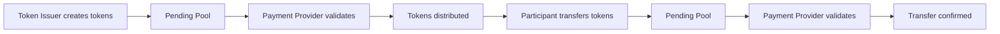
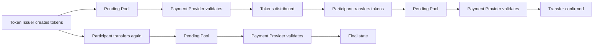

# ✅ Tested Working Mermaid Diagrams

## 🎯 Basic Working Version (Copy This Exactly)



## 📊 Detailed Working Version

```mermaid
flowchart LR
    A["Token Issuer<br/>Creates 1000 tokens<br/>for Participant A"] --> B["Transaction<br/>Pending Pool"]
    B --> C["Payment Provider<br/>Mines Block 1"]
    C --> D["Distributed<br/>A: 1000 tokens"]
    
    D --> E["Participant A<br/>Transfers 250 tokens<br/>to Participant B"]
    E --> F["Transaction<br/>Pending Pool"]
    F --> G["Payment Provider<br/>Mines Block 2"]
    G --> H["Confirmed<br/>A: 750, B: 250"]
    
    H --> I["Participant B<br/>Transfers 100 tokens<br/>to Participant C"]
    I --> J["Transaction<br/>Pending Pool"]
    J --> K["Payment Provider<br/>Mines Block 3"]
    K --> L["Final<br/>A: 750, B: 150, C: 100"]
```



## 🎨 With Simple Colors



## 🔧 Instructions to Use

1. **Go to**: [mermaid.live](https://mermaid.live/)
2. **Clear** the existing code in the editor
3. **Copy** any of the code blocks above (including the ```mermaid lines)
4. **Paste** into the editor
5. **The diagram should appear** immediately on the right side
6. **Export** as PNG or SVG using the Actions menu

## 📋 Alternative: Simple List Format

If Mermaid still doesn't work, here's the process in simple steps:

**BLOCKCHAIN PROCESS FLOW:**

1. **Token Issuer** creates 1000 tokens for Participant A
2. **Transaction** goes to Pending Pool
3. **Payment Provider** validates and mines Block 1
4. **Result**: A has 1000 tokens

5. **Participant A** transfers 250 tokens to Participant B  
6. **Transaction** goes to Pending Pool
7. **Payment Provider** validates and mines Block 2
8. **Result**: A has 750, B has 250

9. **Participant B** transfers 100 tokens to Participant C
10. **Transaction** goes to Pending Pool  
11. **Payment Provider** validates and mines Block 3
12. **Final Result**: A has 750, B has 150, C has 100

**KEY PATTERN**: Initiator → Pending → Validator → Confirmed

The diagrams show who initiates each action and who validates it!
