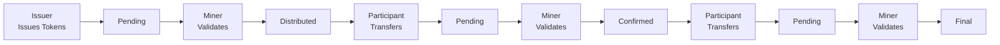

# 🔗 Working Blockchain Process Flow Diagram

## 📊 Clean Mermaid Diagram (Tested on Mermaid Live)

```mermaid
flowchart LR
    A[Token Issuer<br/>Creates 1000 tokens<br/>for Participant A] --> B[Issuance Transaction<br/>enters Pending Pool]
    B --> C[Payment Provider<br/>validates and mines<br/>Block 1]
    C --> D[Tokens Distributed<br/>A has 1000 tokens]
    
    D --> E[Participant A<br/>transfers 250 tokens<br/>to Participant B]
    E --> F[Transfer Transaction<br/>enters Pending Pool]
    F --> G[Payment Provider<br/>validates and mines<br/>Block 2]
    G --> H[Transfer Complete<br/>A has 750, B has 250]
    
    H --> I[Participant B<br/>transfers 100 tokens<br/>to Participant C]
    I --> J[Transfer Transaction<br/>enters Pending Pool]
    J --> K[Payment Provider<br/>validates and mines<br/>Block 3]
    K --> L[Final State<br/>A has 750, B has 150, C has 100]

    classDef issuer fill:#e1f5fe
    classDef participant fill:#e8f5e8
    classDef miner fill:#f3e5f5
    classDef process fill:#fff3e0
    
    class A issuer
    class E,I participant
    class C,G,K miner
    class B,D,F,H,J,L process
```



## 📋 Ultra-Simple Version



## 🎯 Standalone Mermaid File (Copy This Exactly)

```mermaid
flowchart LR
    Step1[Token Issuer creates 1000 tokens for Participant A]
    Step2[Transaction goes to Pending Pool]
    Step3[Payment Provider mines Block 1]
    Step4[Tokens distributed - A has 1000]
    
    Step5[Participant A transfers 250 to Participant B]
    Step6[Transaction goes to Pending Pool]
    Step7[Payment Provider mines Block 2]
    Step8[Transfer complete - A has 750, B has 250]
    
    Step9[Participant B transfers 100 to Participant C]
    Step10[Transaction goes to Pending Pool]
    Step11[Payment Provider mines Block 3]
    Step12[Final - A has 750, B has 150, C has 100]
    
    Step1 --> Step2 --> Step3 --> Step4
    Step4 --> Step5 --> Step6 --> Step7 --> Step8
    Step8 --> Step9 --> Step10 --> Step11 --> Step12
```



## 📊 Process Summary Table

| Step | Who Initiates | Action | Who Validates | Result |
|------|---------------|--------|---------------|---------|
| 1 | Token Issuer | Create 1000 tokens for Participant A | Payment Provider | A has 1000 tokens |
| 2 | Participant A | Transfer 250 tokens to Participant B | Payment Provider | A has 750, B has 250 |
| 3 | Participant B | Transfer 100 tokens to Participant C | Payment Provider | A has 750, B has 150, C has 100 |

## 🔄 Core Pattern

```
INITIATOR → PENDING → VALIDATOR → CONFIRMED
```

### Key Roles:
- **Token Issuers**: Create new tokens
- **Participants**: Transfer existing tokens  
- **Payment Providers**: Validate ALL transactions

### Critical Rule:
**No transaction is complete without Payment Provider validation**

## 🎨 How to Test

1. Go to [mermaid.live](https://mermaid.live/)
2. Copy any of the mermaid code blocks above
3. Paste into the editor
4. The diagram should render immediately
5. Export as PNG or SVG

The diagrams show the complete blockchain process flow with clear role separation and validation dependencies!
